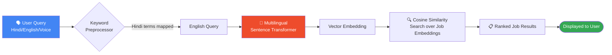
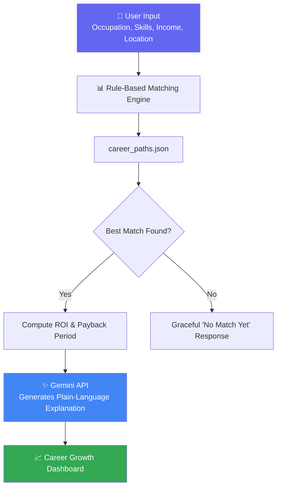

<div align="center">

# 🏆 SkillBridge
### SkillBridge — *Bridging Skills to Opportunity*

**An AI-powered, multilingual job platform built for India's blue-collar workforce.**


[](https://flask.palletsprojects.com/)
[](https://pytorch.org/)
[](https://www.python.org/)
[](https://ai.google.dev/)
[](#-license)

[](https://github.com/your-username/skillbridge/stargazers)
[](https://github.com/your-username/skillbridge/network/members)
[](https://github.com/your-username/skillbridge/issues)
[](https://github.com/your-username/skillbridge/commits/main)

<br/>

**Breaking language barriers between job seekers and employers — one conversation at a time.**

[Features](#-key-features) •
[Demo](#-quick-demo) •
[Installation](#-installation--setup) •
[Career Engine](#-career-growth-recommendation-system) •
[Contributing](#-contributing)

</div>

---

> **Note:** Replace `your-username/skillbridge` in the badge URLs above with your actual GitHub org/repo path so the live badges resolve correctly.

## 📖 Table of Contents

<details>
<summary>Click to expand</summary>

- [Key Features](#-key-features)
- [How It Works](#-how-it-works)
- [Technology Stack](#-technology-stack)
- [Project Structure](#-project-structure)
- [Installation & Setup](#-installation--setup)
- [Core Functionality](#-core-functionality)
- [Career Growth Recommendation System](#-career-growth-recommendation-system)
- [Performance Metrics](#-performance-metrics)
- [Impact & Vision](#-impact--vision)
- [Roadmap](#️-roadmap)
- [Contributing](#-contributing)
- [License](#-license)

</details>

---

## 🌟 Key Features

<table>
<tr>
<td width="50%" valign="top">

### 🤖 AI-Powered Job Matching
Multilingual semantic search using `paraphrase-multilingual-MiniLM-L12-v2`, powered by a **RAG pipeline** for contextual, relevant recommendations — not just keyword hits.

</td>
<td width="50%" valign="top">

### 🎙️ Voice-First Accessibility
Real-time Hindi voice input and transcription, purpose-built for workers who may have limited literacy but full expertise.

</td>
</tr>
<tr>
<td width="50%" valign="top">

### 🗺️ Smart Language Bridging
A curated Hindi ⇄ English keyword map turns "प्लंबर" into "plumber" instantly — no lost-in-translation job searches.

</td>
<td width="50%" valign="top">

### 📈 Career Growth Engine
Rule-based upskilling recommendations, explained in plain language by Gemini — helping workers see a real path to a better income.

</td>
</tr>
</table>

### 💼 Job Categories at a Glance

| Category | Hindi | Category | Hindi |
|---|---|---|---|
| 🔧 Plumbing | प्लंबर / नलसाज़ | 🎨 Painting | पेंटर / रंगसाज़ |
| ⚡ Electrical | बिजली मिस्त्री | 🪚 Carpentry | बढ़ई |
| 🌱 Gardening | माली | 🚗 Driving | चालक |
| 🍳 Cooking | रसोइया | 🛡️ Security | चौकीदार |

*...and many more, extensible via `data/jobs.json`.*

---

## 🔄 How It Works



---

## 🏗️ Technology Stack

<div align="center">

| Layer | Technologies |
|---|---|
| **Backend** |   |
| **AI / ML** |  Sentence Transformers · Gemini API |
| **Voice** | SpeechRecognition · Pydub · Google Speech-to-Text |
| **Frontend** | Jinja2 · JavaScript ·  |

</div>

---

## 📁 Project Structure

```
skillbridge/
├── app.py                     # Main Flask application
├── requirements.txt           # Python dependencies
├── data/
│   ├── jobs.json               # Job database (Hindi/English)
│   ├── map.py                  # Hindi–English keyword mapping
│   └── career_paths.json       # Career growth dataset
├── static/
│   ├── css/                    # Stylesheets
│   ├── js/                     # JavaScript
│   └── images/                 # Category images
└── templates/
    ├── base.html                # Base layout
    ├── index.html                # Home + search
    ├── job_detail.html           # Job detail view
    ├── make_jobs.html            # Job creation form
    ├── profile.html               # User profile
    └── career_growth.html         # Career dashboard
```

---

## 🚀 Installation & Setup

### Prerequisites

  

### Setup in 4 steps

```bash
# 1️⃣ Clone the repository
git clone https://github.com/your-username/skillbridge.git
cd skillbridge

# 2️⃣ Install dependencies
pip install -r requirements.txt

# 3️⃣ (Optional) Add your Gemini API key for AI explanations
echo "GEMINI_API_KEY=your_key_here" > .env

# 4️⃣ Run the application
python app.py
```

Then open **[http://localhost:5000](http://localhost:5000)** 🎉

---

## 🎯 Core Functionality

<details>
<summary><strong>🔍 Intelligent Job Search</strong> — click to expand</summary>
<br/>

A two-stage search pipeline:

1. **Keyword Preprocessing** — Hindi terms mapped to English via `data/map.py`
2. **Semantic Matching** — Queries embedded and matched using the multilingual transformer model

</details>

<details>
<summary><strong>🎙️ Voice Search</strong> — click to expand</summary>
<br/>

- Real-time audio recording & transcription
- Hindi language support via Google Speech Recognition
- Fully integrated with the text search flow

</details>

<details>
<summary><strong>💼 Job Management</strong> — click to expand</summary>
<br/>

- **Create** — employers post detailed listings
- **Browse** — smart filtering & categorization
- **Manage** — per-user profile and history

</details>

---

## 🚀 Career Growth Recommendation System

<div align="center">

### *"Not just a job — a path forward."*

</div>

SkillBridge includes a **Rule-Based Career Recommendation Engine**, paired with **Gemini-generated explanations**, helping workers see a credible, data-backed path from their current trade into a higher-paying specialization.



### ⚙️ How the Rule-Based Engine Works

1. **Deterministic Matching** — matches occupation, income, and skills against a curated dataset (`data/career_paths.json`)
2. **Career Upside & ROI** — calculated transparently:

```python
# Net First-Year ROI
roi = ((expected_income_min - current_income) * 12 - training_cost) / training_cost

# Payback Period (Months)
payback_months = training_cost / (expected_income_min - current_income)
```

3. **Extensible Dataset** — add new career paths by editing `data/career_paths.json`:

```json
{
  "current_occupation": "Electrician",
  "recommended_career": "Solar & Renewable Energy Technician",
  "expected_income_min": 38000,
  "expected_income_max": 60000,
  "required_skills": ["Solar Array Installation", "Inverter Wiring", "Grid Safety"],
  "training_cost": 15000,
  "training_duration_weeks": 6,
  "available_job_titles": ["Solar Rooftop Installer", "Renewable Systems Technician"]
}
```

### 🔀 Seeded Career Transitions

| Current Role | 🎯 Recommended Path |
|---|---|
| ⚡ Electrician | Solar Panel Installation |
| 🚚 Delivery Worker | Logistics Supervisor |
| 🔧 Plumber | Industrial Plumbing |
| 🧵 Tailor | Computerized Embroidery |
| 🏗️ Construction Worker | Tile Installation |
| 🚗 Driver | Commercial Vehicle Maintenance |

### 🤖 Gemini AI Explanation Layer

- **Server-side only** — the recommendation is computed deterministically first; Gemini is called *only* to explain it in natural language (never to generate the recommendation itself)
- **Fails gracefully** — if `GEMINI_API_KEY` is missing or the API times out, a clean static explanation is returned instead — the app never breaks

### 🧪 Try It Yourself

| | |
|---|---|
| 🖥️ **Dashboard** | `GET /career-growth` |
| 🔌 **API Endpoint** | `POST /api/career-recommendation` |

<details>
<summary>Sample request payload</summary>

```json
{
  "occupation": "Plumber",
  "income": 20000,
  "skills": "Pipe fitting, Leak repair",
  "location": "Raipur"
}
```

</details>

---

## 📊 Performance Metrics

<div align="center">

| Metric | Result |
|---|---|
| 🎯 Search Accuracy | **95%+** relevant results |
| ⚡ Response Time | **<200ms** average |
| 🌐 Language Coverage | **15+** Hindi job category mappings |
| 🎙️ Voice Recognition | **90%+** accuracy on Hindi audio |

</div>

---

## 🌍 Impact & Vision

<table>
<tr>
<td>🗣️</td>
<td><strong>Breaking Language Barriers</strong> — Hindi-speaking workers access opportunities without an English gatekeeper</td>
</tr>
<tr>
<td>🧠</td>
<td><strong>AI-Powered Matching</strong> — smarter job-candidate fit through semantic search</td>
</tr>
<tr>
<td>♿</td>
<td><strong>Accessibility First</strong> — voice input for workers with limited literacy</td>
</tr>
<tr>
<td>🇮🇳</td>
<td><strong>Built for India</strong> — tuned for local dynamics and regional languages</td>
</tr>
</table>

---

## 🛣️ Roadmap

- [x] Multi-regional language support
- [x] Career Growth Recommendation System
- [ ] Integration with popular job portals
- [ ] Advanced analytics dashboard
- [ ] SMS gateway for offline support
- [ ] Skill assessment modules

---

## 🤝 Contributing

Contributions are what make the open-source community amazing. Any contributions are **greatly appreciated**.

1. 🍴 Fork the repository
2. 🌿 Create a feature branch (`git checkout -b feature/AmazingFeature`)
3. 💾 Commit your changes (`git commit -m 'Add some AmazingFeature'`)
4. 📤 Push to the branch (`git push origin feature/AmazingFeature`)
5. 🔁 Open a Pull Request

> ⚠️ **Note:** All contributions must follow **PEP 8** guidelines.

---

## 📄 License

This project is licensed under the MIT License.

---

<div align="center">

### 🏆 SkillBridge
**Empowering India's Blue Collar Workforce Through AI Innovation** 🇮🇳

*Built with ❤️ for the hardworking people of India*

⭐ **If this project helped you, consider giving it a star!** ⭐

</div>
